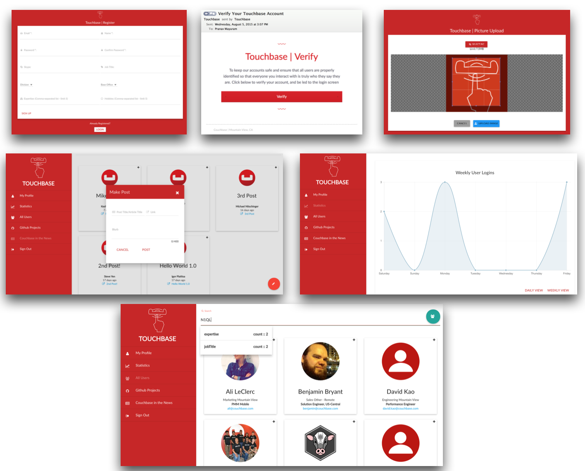

<p align="center"></p>

#Touchbase
**Created By:** Pranav Mayuram

An opensource NoSQL social network platform using Couchbase Server 4.0 (featuring N1QL), as well as Express, Angular and Node (the JavaScript web stack). The UI is created primarily using Angular Material Design, as well as parts of Bootstrap, Semantic UI and Materialize CSS. A preview of one use-case for the product can be seen below. These images are for a network built using Touchbase, made to be used as an internal social network for Couchbase employees.

<p align="center"></p>

Using the setup specified in this README, you will be able to create your own customized social network with a multitude of features. These include:

* **Login and Registration**
* **Email Verification**
* **Session-based user authentication for security**
* **Searchable user profiles**
* **Profile pictures uploads with cropping**
* **Statistics page with login graphing over time**
* **Ability to customize one's personal profile**
* **Searchable user posts, separated by type**
* **Beautiful Material Design**

Many of these features can be further customized by any developer using the 'config.json' file. For example, the purpose of the social network is up to you, and the user fields that users are asked for can also be customized accordingly. The same applies for the different types of posts you would like to have in your network. Ability to change the color scheme and branding are also explained thoroughly in this README. 

### Prerequisites
For the contents of this README, it is assumed that you have the following items setup.

1. System-specific prerequisites for node-gyp at https://github.com/nodejs/node-gyp
2. A working Couchbase Server 4.0 cluster, single node will do for exploring with enough free RAM for at least one bucket
3. A Sendgrid Web API account
4. Node.js & NPM (node >= 3.3 with npm >= 3.3 should do)
5. GraphicsMagick (`brew install graphicsmagick` on Mac OS X)

If you lack any one of these things, proper installation and setup can be seen in <a href="PREREQUISITES.md">PREREQUISITES.md</a>.

### Getting the Project
The simplest way to get Touchbase is simply to clone it to wherever you choose. Keep track of the directory where you clone the Touchbase repo, as you will have to navigate to it in the future.

Simply navigate to the directory where you want to keep Touchbase (Documents, Desktop, etc.) in your command line (Terminal) where you want to keep the project folder and run the following command: 

````$ git clone https://github.com/couchbaselabs/touchbase.git````

This will now create the folder in that directory, and you can enter the folder, and then one level deeper into 'TouchbaseModular' (**touchbase/TouchbaseModular**). Here is where you will need to navigate when doing anything specific to your project.

### Installing Node Modules and Bower Components
***This is project-specific. Navigate to your project directory to run these commands in your command line. If you don't have the project downloaded, check 'Getting the Project'.***

######NPM
Once NPM (node package manager) is properly available, run one simple command:

````$ npm install````

Then, this will install all modules that were specified for the project in the 'package.json' file. You may need to use **sudo** before the command to do it as a root/administrator.
All of these modules will be put into the 'node_modules' folder and then be accessed in the back-end javascript files using 'require' statements, or ````<script src="filepath">```` tags in HTML to access the necessary files.

######Bower
Now run another command with NPM:

````$ npm install -g bower````

This will install another package manager that other necessary components can be downloaded with.

After installing bower, run this command:

````$ bower install````

This will now install all the components specified in the 'bower.json' file that were included in the project.
All of these components will be downloaded into the 'bower_components' folder and can also be accessed through 'require' statements, or ````<script src="filepath">```` tags in HTML to access the necessary files.

### Sendgrid API Setup
The Nodemailer Sengrid API method was used to ensure that the emails do not go to users' spam folders, and it also allows statistics about the emails to be tracked directly from the Sendgrid dashboard.

Enter your Sendgrid username and password to the 'config.json' file after you successfully create your account. This will ensure that all emails are sent safely through one's account. These changes will be reflected in the 'sessionmodel.js' file in the 'Session.makeVerification' function.

### Customizing your application

For this, you must be looking at your **config.json** file to create a fully customized application. There are a few other files that will have to be adjusted, but the main one is this.

###### Basic Customization (User Attributes, Project Name, etc.)

1. **Project Basics :** To customize these, this will simply require one to change the attribute in the 'config.json' file.
  * Changing the 'projectName' attribute will be reflected everywere in the front-end UI.
  * Changing the 'primaryAttribute' will change what the user is asked for in the registration process, and also how they are displayed in the 'All Users' page, as well as their posts. One example would be 'Name'.

2. **User Attributes :** To customize the user attributes, there are a few things one can do. The basic application structure has three kinds of basic data models, which are **stringAttributes**, **arrayAttributes**, and **dropdownAttributes**. Changing these attributes will change the form for registration, as well as the terms that are searched, and attributes that show up on each user's profile.
  * To change the stringAttributes, and arrayAttributes, simply change the arrays that are in the 'config.json' file. An arrayAttribute would ask for a comma-separated list of items with a max limit of 5 in the current implimentation, for example, 'Hobbies'. A stringAttribute would accept any string, for example, 'Job Title'.
  * To change the dropdownAttributes, one would have to change the array of objects that are used in the 'config.json' file. The 'varname' in each object simply describes the type of variable that one wants, for example, 'Base Office'. The 'options' array in each object is a list of options that will be presented in each dropdown.

###### Bucket Customization
To simply customize the bucket names, one can just change the names in the 'config.json' document and then adjust the names of their bucket names in the **Bucket Setup** section. 

It is also possible to overlap the buckets and put all of the data in one bucket. This is an important feature, since current releases of Couchbase support a maximum of 10 buckets. If one would like to do this, it may be advisable to increase the RAM quota allowed for the bucket, so that it can accomodate all the data.

###### Post Customization
For Touchbase, handling different kinds of posts means putting them in different sections of the website. 
For example, if one wanted to put a set of company news articles in one section, they may have a section like 'Couchbase in the News'. 
If they also wanted to have an area for company github projects, there may be a separate section called 'Github Projects'. This is how the data is stratified.

These are considered different kinds of posts as well, and this can be reflected when one looks at the 'My Posts' section in the 'My Profile' section after they make a few posts. Creating proper customization takes a few separate steps.

1. **Picking Different Post Types :** To create different posts, change the 'pubTypes' array of object. Each 'pubTypes' object has a 'type' attribute which is the type that will be seen in the navbar. Examples would be 'Github Projects', 'Couchbase in the News', etc.
2. **Changing imagePath :** To change the 'imagePath' attribute in each 'pubTypes' object, place the image you want for this type of post into the 'icons' folder. Then take the name of the image and put it as the 'imagePath' attribute.
3. **Changing icon :** To change the 'icon' attribute for each type of post, simply go to http://semantic-ui.com/elements/icon.html and find the icon you want to display for this post type in the navbar. Take the name for the icon, for example 'github', or 'newspaper' and write that into the 'icon' attribute for the object.

###### Color/Logo Customization
Changing the colors and various logos for the application is an important part of creating an identity for the social network. There are a few basic steps to this.

1. **Logo :** If you are told there is already an image with this name, go ahead and 'Replace', or delete the existing image and replace it with your own.
  * Go into the 'icons' folder, and drag in your logo for your application, and rename it to **touchbaseLogo.png**. The logo will now reflect your changes.
  * To change the default profile picture, go into the 'icons' folder, drag in the image you want, and rename it to **default_picture.png**.
  * To change the favicon (icon that is shown on the top of a tab, along with HTML page title).  This can be generated at http://www.favicon-generator.org/. The icon that is generated should then be placed in the 'public' folder with the name 'favicon.ico'.
2. **Color :** 
  * First off, go to https://www.google.com/design/spec/style/color.html#color-color-palette. Find a color you like in the different swatches.
  * Then navigate to 'public/js'. Open the 'signUp.js' file and the 'touchbase.js' file. 
  * Go to the '.primaryPalette' and '.backgroundPalette' attributes within the '$mdThemingProvider' service in 'signUp.js'. Then change the color in quotes to the color of the swatch you chose (ex. 'teal'). **Make sure the color name is lowercase!** (ex. 'teal' NOT 'Teal' OR 'TEAL'). Then the number below the color name should be the number of the specific shade you chose (number without '#', ex. '900' or 'a100'). 
  * Make same changes to just '.primaryPalette' in the 'touchbase.js' file. 
  * You could also change the '.accentPalette' attribute in the same way (for both files), though this just changes the colors of a few buttons in the application.
  * Finally, take the hex value given (the one with the '#') for the specific shade of the color you chose on the Google Material Design Colors website. Change the 'colorHex' attribute in the 'config.json' file to this hex value.

Your branding and color customization is now complete!

### Bucket Setup

Once you have a working version of Couchbase Server, go to **http://IpOfyourMachine:8091**, such as localhost if running locally. **Make sure that you have Couchbase Server running**. On Mac, this is done simply by clicking Couchbase Server in Launchpad. You will see the Couchbase logo in your dock near the wifi label in the top right hand side of the menu bar. Then complete the following steps.
 1. Login, and then navigate to the **'Data Buckets'** tab at the top of the screen.
 2. From here you can create these 3 buckets simply and easily using the 'Create Bucket' button. These buckets will be called **users** and **users_pictures** and **users_publishments**. Changing these bucketnames is possible in the 'config.json' file. If you changed 'config.json' to use only one bucket, or two buckets, simply create those one or two buckets.
  4. Allot around 100 mb each to these buckets for initial testing, and closer to 300mb to use the **users_pictures** bucket. If you used only one or two buckets, just increase the amount of RAM for the bucket that is storing the pictures.
  5. After you select the amount of RAM you want for each bucket, ignore all other options, scroll down and hit **Create Bucket**.

There are 2 ways to go set up the buckets with indexes, one being far simpler than the other.

1. **Simple :** Set up your primary indexes, as well as some basic indexes for user searches using a simple API endpoint. 
  * Complete the **Running the App** section.
  * Redirect your webpage to **http://IPofYourMachine:3000/api/createPrimaryIndexes** assuming you're running the application in the same place you're running Couchbase Server. Use localhost for IPofYourMachine if the Couchbase Server instance is running on the same machine that you are currently on. Also if you changed your port in 'config.json', replace 3000 with that port number.
  * You should see 'Primary Indexes Created' after some time, at which point the setup is complete.
  * It may be good to restart your node.js instance using Ctrl + C and then running the command to start the app once more.
You should now be all prepared for the app to use your back-end appropriately.

2. **Manual :** If you really, truly want to do this manually, go into the [cbq shell][1], and run these three commands. If you changed your bucket names in 'config.json', change them accordingly for these commands.
  *  ````CREATE PRIMARY INDEX ON users````
  *  ````CREATE PRIMARY INDEX ON users_pictures````
  *  ````CREATE PRIMARY INDEX ON users_publishments````

### Running the app
***This is project-specific. Navigate to your project directory to run these commands in your command line. If you don't have the project downloaded, check 'Getting the Project'.***

Most setup is complete at this point. First, navigate into 'TouchbaseModular'.

Once in this folder, use the command ````$ node app.js```` (or nodemon if you prefer), to run the project.

The console will now have a message saying "View Touchbase at localhost:3000" (maybe a different port depending on 'config.json' file).
Redirect your browser to this location, and view the project! 
If you have not yet created your indexes, go ahead and redirect to **http://IPofYourMachine:3000/api/createPrimaryIndexes** as mentioned in **Bucket Setup**.
Congratulations on your custom app :)

### Post Launch
###### Logs
In many other web servers, the logs are found in a certain file, however, Node.js prints directly to the 'STDERR' and 'STDOUT' on the console. This can be configured differently if desired as mentioned at  http://stackoverflow.com/questions/8393636/node-log-in-a-file-instead-of-the-console.

###### HTTPS
The process of using 'https' protocol is rather simple using a self-signed cert, and that is how the current system is implemented. Using CA signed certs is still **EXPERIMENTAL** and should be live shortly. This will be updated in the near future as it is an important security measure.

### Conclusion

Hopefully you find this application helpful, especially the use of N1QL and Couchbase Server 4.0 with Node.js. Please file any errors/questions on the [github project][2], and they will be answered as soon as possible.

### License

<a href="LICENSE.md">MIT ©</a>

[1]: http://developer.couchbase.com/documentation/server/4.0/n1ql/n1ql-intro/cbq.html
[2]: http://github.com/couchbaselabs/touchbase/
